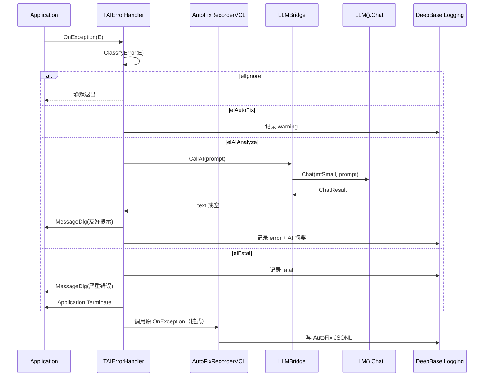
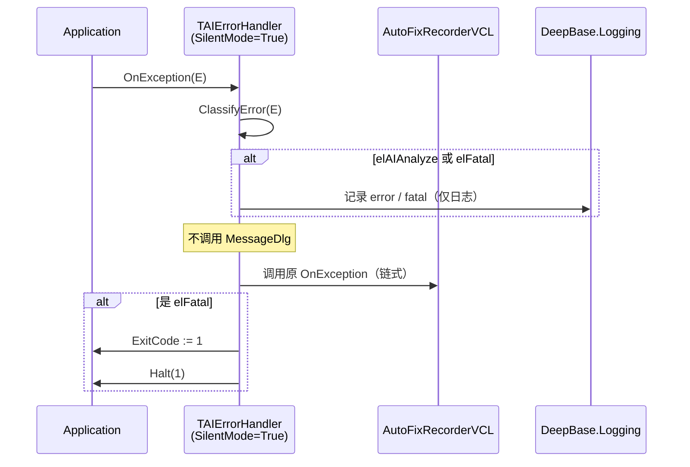
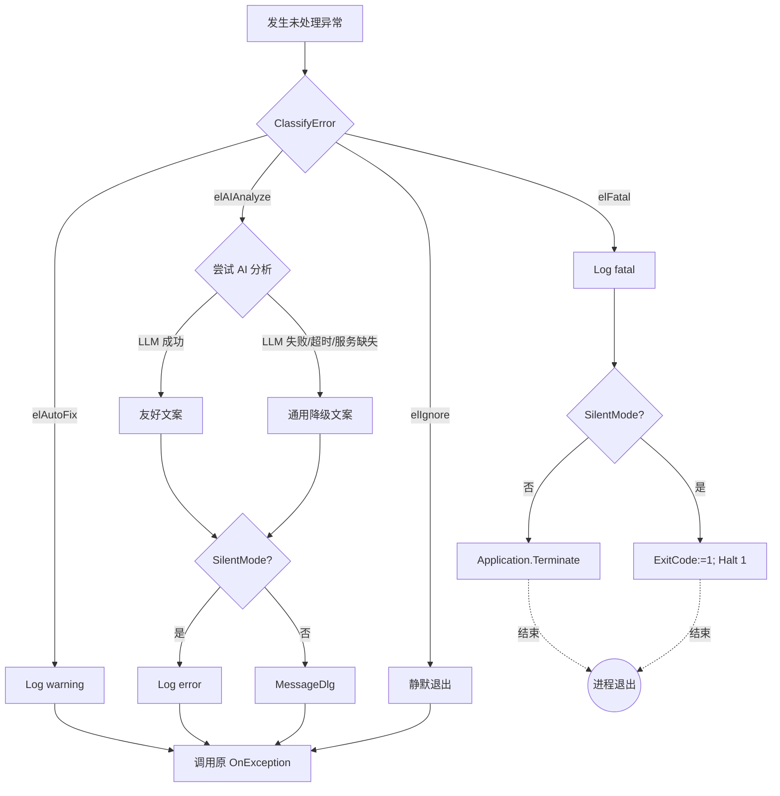

# 设计文档：AIErrorHandler 全工作区铺开（aierrorhandler-rollout）

## 概述（Overview）

本设计把 `DeepBase.AIErrorHandler` 部件铺开到 02Business 工作区下约 90 个 `.dpr` 入口。设计的核心思路是：

1. 不写新的异常处理引擎，复用现有 `TAIErrorHandler` 的分类、缓存、超时逻辑
2. 新增**两个轻量单元**作为铺开胶水：`DeepBase.AIErrorHandler.Bootstrap`（一行入口）+ `DeepBase.AIErrorHandler.LLMBridge`（接 LLM）
3. 对 `DeepBase.AIErrorHandler.pas` 做**两处加性内部修改**：`TAIErrorConfig` 新增 `SilentMode` 字段、`Install` 改为"链式"挂钩 `Application.OnException`。两处修改都不改对外可见签名
4. 用一个 90 项分组清单驱动分批铺开，每批独立编译验证

设计的边界：

- 本 spec **只铺开 VCL 与 VCL Console 入口**，FMX 入口（DeepDev、DeepDevLite）在另一个后续 spec 中处理（理由见"决策与权衡"）
- 本 spec **不重构 AutoFix_Recorder**，仅保证 AIErrorHandler 与之共存
- 本 spec **不调整 LLM 调用配额、计费、模型选型**，复用 `LLM().Chat` 现有行为

### 决策与权衡

| 决策 | 替代方案 | 选择理由 |
|---|---|---|
| AIErrorHandler 核心保持 VCL 绑定，FMX 程序本期不铺开 | 抽出平台无关核心 + 两个适配器 | 两个 FMX 程序占比小（2/90），抽核心需要改 `TAIErrorHandler.Install` 与 `Handle` 的可见行为，超出 R5.3 边界 |
| Bootstrap 暴露的是过程而非类 | Singleton 类 `TAIErrorBootstrap.Install` | 调用方只用一行，过程式更省事；状态由底层 AIErrorHandler 自带 |
| Test_Mode 通过 `TAIErrorConfig.SilentMode` 字段下沉到核心 | Bootstrap 自己挂另一个 OnException 屏蔽 MessageDlg | 字段法与现有 `ShowTechnicalDetails` 字段同结构，改动最小，且能复用 Handle 现有的分类、缓存、降级逻辑 |
| Install 改为链式挂钩 | Bootstrap 在外面包一层 | 链式逻辑放在 Install 内一次写对，对所有未来调用方都生效；外层包装会让 AutoFix 与 AIErrorHandler 的相对顺序变得脆弱 |
| LLM 桥用 `TModelTier.mtSmall`（或等价"小模型"等级） | 走默认 tier | 错误诊断属于轻量短文本，用小模型省成本、降延迟；具体常量名以 `DeepBase.LLM.Types` 实际定义为准 |

## 体系结构（Architecture）

```mermaid
flowchart LR
    DPR[".dpr 入口程序<br/>（90 个）"] -->|uses + 1 行调用| BS[DeepBase.AIErrorHandler.Bootstrap]
    BS --> AH[DeepBase.AIErrorHandler<br/>TAIErrorHandler]
    BS --> LB[DeepBase.AIErrorHandler.LLMBridge]
    BS -.可选共存.-> AF[DeepBase.AutoFix.ErrorRecorder.VCL]
    AH -->|链式调用| OLD[原 Application.OnException]
    AH -->|SetAICallback| LB
    LB -->|LLM().Chat| SVC[DeepBase.LLM.Service]
    AH -->|Log| LOG[DeepBase.Logging]
    AF -->|Log| LOG
```

### 调用时序（Production_Mode 下的 VCL 异常）



### 调用时序（Test_Mode 下）



### 模块拓扑

| 模块 | 路径 | 职责 |
|---|---|---|
| AIErrorHandler（既有，加性修改） | `DeepBase/Core/DeepBase.AIErrorHandler.pas` | 异常分类、缓存、降级、`MessageDlg`、链式挂钩 |
| Bootstrap（新增） | `DeepBase/Core/DeepBase.AIErrorHandler.Bootstrap.pas` | 一行入口、Test_Mode 探测、AutoFix 共存 |
| LLMBridge（新增） | `DeepBase/Core/DeepBase.AIErrorHandler.LLMBridge.pas` | 把 `TAIAnalysisCallback` 桥到 `LLM().Chat` |
| AutoFix_Recorder（既有，不改） | `DeepBase/Core/DeepBase.AutoFix.ErrorRecorder.pas` 等 | 已经在用，链式即可 |

## 组件与接口（Components and Interfaces）

### 1. Bootstrap 单元接口

```pascal
unit DeepBase.AIErrorHandler.Bootstrap;

interface

uses
  System.SysUtils,
  DeepBase.AIErrorHandler;

type
  /// 铺开模式
  TAIErrorBootstrapMode = (
    bmAuto,        // 默认：根据环境变量/编译指令自动判断
    bmProduction,  // 强制 Production_Mode
    bmTest         // 强制 Test_Mode
  );

/// <summary>
/// 一行入口：装上 AIErrorHandler、接好 LLM、处理 AutoFix 共存。
/// 同进程内重复调用幂等；返回 True 表示本次调用真正完成了安装。
/// </summary>
function InstallAIErrorHandler(AMode: TAIErrorBootstrapMode = bmAuto): Boolean; overload;

/// <summary>带自定义配置的安装入口。</summary>
function InstallAIErrorHandler(const AConfig: TAIErrorConfig;
  AMode: TAIErrorBootstrapMode = bmAuto): Boolean; overload;

/// <summary>测试入口语义糖：等价于 InstallAIErrorHandler(bmTest)。</summary>
function InstallAIErrorHandlerForTests: Boolean;

/// <summary>判断当前进程是否处于 Test_Mode（环境变量或编译指令命中）。</summary>
function IsTestMode: Boolean;

implementation

// 关键实现要点（伪代码）：
// 1. 用一个 class var FInstalled: Boolean 保证幂等
// 2. 解析 mode：bmAuto → IsTestMode 决定；bmTest/bmProduction → 强制
// 3. 读 TAIErrorConfig.Default，若 Test_Mode 把 SilentMode 置 True
// 4. 调 TAIErrorHandler.Install(LConfig)（Install 内部自己处理链式挂钩）
// 5. 调 LLMBridge.InstallCallback；任何异常都吞，OutputDebugString 报告
// 6. 全过程不抛异常给上层
end.
```

### 2. LLMBridge 单元接口

```pascal
unit DeepBase.AIErrorHandler.LLMBridge;

interface

uses
  DeepBase.AIErrorHandler;

/// <summary>
/// 把 AIErrorHandler 的 AICallback 接到 DeepBase.LLM.Service.LLM().Chat。
/// 找不到 LLM 服务、Chat 失败、返回结果非成功，统一返回空字符串，
/// AIErrorHandler 自动走降级文案。
/// </summary>
procedure InstallLLMBridge;

implementation

// 关键实现要点（伪代码）：
// 1. 创建一个匿名 TAIAnalysisCallback：
//      function(const APrompt: string): string
//      try
//        LResult := LLM().Chat(<small tier>, APrompt);
//        if LResult.Success then Result := LResult.Content
//        else Result := '';
//      except
//        Result := '';
//      end
// 2. 调 TAIErrorHandler.SetAICallback(LCallback)
// 3. 该单元的接口本身不抛异常
//
// 与 LLM 服务的可用性弱耦合：LLM().Chat 在 Service 不可用时
// 内部就会返回 Success=False，桥接层不需要做单独的可用性检查。
end.
```

### 3. AIErrorHandler 内部修改清单（加性，不改公开签名）

`DeepBase/Core/DeepBase.AIErrorHandler.pas` 中的具体改动：

```pascal
// 改动 A：TAIErrorConfig 新增 SilentMode 字段
TAIErrorConfig = record
  AIEnabled: Boolean;
  MaxCacheSize: Integer;
  AITimeoutMs: Integer;
  ShowTechnicalDetails: Boolean;
  LogPath: string;
  SilentMode: Boolean;  // ← 新增；默认 False；True 则不弹 MessageDlg
  class function Default: TAIErrorConfig; static;
end;

// 改动 B：TAIErrorHandler 内部加 FOldAppException 字段，Install 改为链式
class var FOldAppException: TExceptionEvent;

class procedure TAIErrorHandler.Install(const AConfig: TAIErrorConfig);
begin
  if FInstalled then Exit;
  FConfig := AConfig;
  if FCache = nil then FCache := TDictionary<string, string>.Create;
  FOldAppException := Application.OnException;        // ← 新增
  Application.OnException := DoApplicationException;
  FInstalled := True;
end;

class procedure TAIErrorHandler.DoApplicationException(Sender: TObject; E: Exception);
begin
  try
    Handle(E);
  finally
    if Assigned(FOldAppException) then               // ← 新增链式调用
      FOldAppException(Sender, E);
  end;
end;

// 改动 C：Handle 内的 MessageDlg 调用受 SilentMode 控制
class procedure TAIErrorHandler.Handle(E: Exception; const AContext: string);
begin
  ...
  case LLevel of
    elAIAnalyze:
      begin
        ...
        if not FConfig.SilentMode then               // ← 新增条件
          MessageDlg(LUserMsg, mtWarning, [mbOK], 0);
        DeepBase.Logging 写日志（保持原状或修复，见改动 D）
      end;
    elFatal:
      begin
        DeepBase.Logging 写日志
        if not FConfig.SilentMode then               // ← 新增条件
          MessageDlg('程序遇到严重错误，即将关闭。'#10 + E.Message, mtError, [mbOK], 0);
        if FConfig.SilentMode then                   // ← 新增分支
        begin
          ExitCode := 1;
          Halt(1);
        end
        else
          Application.Terminate;
      end;
  end;
end;

// 改动 D：与 DeepBase.Logging 的实际公开 API 对齐
// 当前源码调用形式 DeepBase.Logging.Log(ltError, S, 'AIErrorHandler') 与 Logging
// 单元的实际 API（TDeepBaseLogger 实例方法 + TLogLevel 常量名）若不一致，
// 改为通过 Logging 单元提供的全局/静态访问点写日志；具体调用形式以 Logging
// 单元实际导出为准（任务阶段实测后修正）。
```

### 4. 各类入口的植入模板

#### 4.1 标准 VCL Main_Program

```pascal
program DeepXxx;

uses
  Vcl.Forms,
  DeepBase.AIErrorHandler.Bootstrap,   // ← 新增 1 行
  ... 其余 uses ...;

{$R *.res}

begin
  InstallAIErrorHandler;               // ← 新增 1 行（Application.Initialize 之前/之后均可）
  Application.Initialize;
  Application.MainFormOnTaskbar := True;
  ... 原有逻辑 ...
  Application.Run;
end.
```

#### 4.2 已有 AutoFix_Recorder 的 VCL Main_Program（如 DeepSpec）

```pascal
begin
  InstallAIErrorHandler;                              // ← 新增
  TAutoFixErrorRecorder.Install;                      // 既有，保留
  TAutoFixErrorRecorderVCL.HookApplication;           // 既有，保留
  Application.Initialize;
  ... 原有逻辑 ...
end.
```

调用顺序无关：Install 内部链式挂钩与 AutoFix 内部链式挂钩两两叠加，最终 `Application.OnException` 触发时两者各执行一次。

#### 4.3 VCL Console Tool_Program（如 DeepBase CLI）

```pascal
program DeepBaseCLI;

{$APPTYPE CONSOLE}

uses
  Vcl.Forms,                            // 控制台仍可 uses Vcl.Forms 拿到 Application
  DeepBase.AIErrorHandler.Bootstrap,    // ← 新增
  ... 其余 uses ...;

begin
  InstallAIErrorHandler;                // ← 新增
  ... 原有 begin..end ...
end.
```

#### 4.4 Test_Program

```pascal
program Test.DeepBase.Xxx;

{$APPTYPE CONSOLE}

uses
  DUnitX.TestFramework,                 // 或其他测试框架
  Vcl.Forms,
  DeepBase.AIErrorHandler.Bootstrap,    // ← 新增
  ... 其余测试单元 ...;

begin
  InstallAIErrorHandlerForTests;        // ← 新增（强制 Test_Mode）
  ... 原有 DUnitX.RunTests 等 ...
end.
```

### 5. 90 项 .dpr 分组（占位骨架，任务阶段填充实际清单）

分组依据：产品归属 + 是否 Test_Program。每组 ≤ 8 个 `.dpr`，每组对应一个铺开任务。

| 组号 | 类型 | 范围 | 估计数量 |
|---|---|---|---|
| G1 | 试点 | DeepSpec.dpr 单一文件 | 1 |
| G2 | Main | DeepCharset、DeepConfig、DeepMoveC、DeepClip、DeepSync | 5 |
| G3 | Main | DeepStory、DeepInsight、DeepSVG、DeepDevLite（保留待评估）、DeepShine | ≤ 5 |
| G4 | Main | DeepCompare 系列、DeepInput 系列、Assayer、AssayerProxy | ≤ 8 |
| G5 | Tool | DeepBase CLI、DeepBaseRun、DeepBaseTray、DeepPublisher | ≤ 4 |
| G6 | Tool | SeedTool、UpdaterHelper、Studio 入口、其他 DeepBase 自家工具 | ≤ 8 |
| G7..GN | Test | Tests/、Smoke/、Behavior/、Governance/ 各目录下 .dpr | 60 个，按目录每组 ≤ 8 |

> 任务阶段第 1 步会先扫描全工作区生成精确清单并写入 `02Business/.kiro/specs/aierrorhandler-rollout/dpr-inventory.md`，再据此开任务。

## 数据模型（Data Models）

本特性几乎不引入新数据结构，主要扩展 `TAIErrorConfig`：

```pascal
TAIErrorConfig = record
  AIEnabled: Boolean;            // 既有
  MaxCacheSize: Integer;         // 既有
  AITimeoutMs: Integer;          // 既有
  ShowTechnicalDetails: Boolean; // 既有
  LogPath: string;               // 既有
  SilentMode: Boolean;           // ★ 新增；True 表示不弹 MessageDlg、Fatal 时 Halt(1)
  class function Default: TAIErrorConfig; static;
end;

TAIErrorBootstrapMode = (bmAuto, bmProduction, bmTest);
```

`TAIErrorConfig.Default` 默认值（含新字段）：

| 字段 | 默认值 |
|---|---|
| AIEnabled | True |
| MaxCacheSize | 50 |
| AITimeoutMs | 8000 |
| ShowTechnicalDetails | False |
| LogPath | '' |
| **SilentMode** | **False** |

Test_Mode 触发条件（任一即触发）：

| 触发源 | 形式 | 优先级 |
|---|---|---|
| 调用方 | 显式 `bmTest` 或 `InstallAIErrorHandlerForTests` | 最高 |
| 编译指令 | `{$DEFINE DEEPBASE_AIEH_TEST}` 出现在编译单元中 | 中 |
| 环境变量 | `DEEP_AIEH_MODE=test`（大小写不敏感） | 中 |
| 默认 | 不命中以上任一 → Production_Mode | 最低 |

## 正确性属性预备分析（Correctness Properties Prework）

下方 prework 由 `prework` 工具记录到上下文，用于驱动后续 Correctness Properties 章节。


## 正确性属性（Correctness Properties）

> **属性是什么**：属性是系统在所有合法执行下都应当成立的特征或行为；它是一条**形式化的"系统应当做什么"的陈述**。属性把人读得懂的需求变成机器可验证的正确性保证，区别于"举例测试"的地方在于它显式包含 *for all* / *for any* 量词，覆盖一类输入而不是一个具体输入。

下面的属性来自 prework 分析的 16 条合并后属性 + 1 条 example。每条属性都标注它所验证的需求条款（**Validates: Requirements X.Y**）。

### Property 1：Install 后置条件（Postcondition Invariant）

*For any* 进程的初始状态，调用 `InstallAIErrorHandler(AConfig)` 之后必须满足以下后置条件全集：
- `Application.OnException` 已被赋值（与 nil 不等）
- `TAIErrorHandler.Config` 与传入的 `AConfig` 字段级相等（不传则等于 `TAIErrorConfig.Default`）
- `TAIErrorHandler` 已设置了非空的 `FAICallback`（由 LLMBridge 注入）
- `TAIErrorHandler` 既有的对外签名（Install、SetAICallback、Handle、SafeRun）保持不变

**Validates: Requirements 1.1, 1.5, 5.3**

### Property 2：Test_Mode 静默不阻塞

*For any* `elAIAnalyze` 或 `elFatal` 级别的异常 E 与 *for any* 上下文字符串 ctx，当 `TAIErrorConfig.SilentMode = True` 时，`TAIErrorHandler.Handle(E, ctx)` 的执行**不会**触发 `Vcl.Dialogs.MessageDlg` 调用，且日志中应至少出现一条对应级别记录。

**Validates: Requirements 2.1, 2.5, 7.2**

### Property 3：Fatal 异常以非零退出码终止

*For any* `elFatal` 级别异常 E，当 `TAIErrorConfig.SilentMode = True` 时，`TAIErrorHandler.Handle(E, _)` 必须**且仅一次**调用注入的 `TerminateProc`，并且使 `ExitCode = 1`。

**Validates: Requirements 2.2, 7.3**

### Property 4：IsTestMode 真值表

*For any* 环境变量值 envVal 与 *for any* 编译指令布尔 defineHit ∈ {True, False}，
`IsTestMode()` 的返回值应等于 `(SameText(envVal, 'test')) OR defineHit`。

**Validates: Requirements 2.3, 2.4**

### Property 5：与既有 OnException Hook 的合流（Confluence）

*For any* 既有 `Application.OnException` 回调集合 H = {h1, h2, ..., hk}（含 0 个或多个回调，包括 `TAutoFixErrorRecorderVCL.AppExceptionHandler`），*for any* 这些 hook 的两种安装顺序 σ1、σ2，*for any* 异常 E：
- 触发 `Application.OnException` 后，集合 H 中每个回调 hi 都被调用恰好一次
- `TAIErrorHandler.Handle` 也被调用恰好一次
- σ1 与 σ2 两种顺序产生的可观测副作用集合（日志条目集合、AICallback 调用集合、AutoFix JSONL 写入集合）相等

**Validates: Requirements 3.1, 3.2, 3.3**

### Property 6：Bootstrap 静态约束

*For any* 编译 `DeepBase.AIErrorHandler.Bootstrap.pas` 的结果：
- 该单元的 interface 段 uses 列表中**不**出现 `Vcl.Dialogs`、`Vcl.Controls`、`FMX.Dialogs`、`FMX.Controls`
- 该单元的 implementation 段中**不**出现对 `System.ExceptProc` 的赋值或修改

**Validates: Requirements 1.4, 3.4**

### Property 7：LLMBridge 透传成功结果

*For any* prompt 字符串 p 与 *for any* mock LLM 客户端 M（其 `Chat(tier, p)` 返回 `TChatResult{Success: True; Content: c}`），LLMBridge 注入的 `TAIAnalysisCallback` 在 prompt p 上调用应返回字符串 c。

**Validates: Requirements 4.1**

### Property 8：LLM 失败 / 缓存损坏 → 空串与降级

*For any* prompt 字符串 p 与 *for any* LLM 失败模式 f ∈ {抛异常, `Success: False`, `Content: ''`, 服务不可用, `FCache` 为 nil 或刚被清空}，LLMBridge 的回调返回值应为空字符串，且 `TAIErrorHandler.Handle` 在该返回值下走通用降级文案分支（不抛、不阻塞）。

**Validates: Requirements 4.2, 10.1, 10.4**

### Property 9：LLMBridge 在 LLM 服务缺失时仍可编译并降级

*For any* 编译时是否链接 `DeepBase.LLM.Service` 的两种情况，`DeepBase.AIErrorHandler.LLMBridge.pas` 都应能被 dcc64 单独编译通过；*for any* `LLM()` 调用站点不可解析的运行时情况，桥接回调返回空字符串。

**Validates: Requirements 4.4**

### Property 10：Bootstrap 重复调用幂等

*For any* 自然数 n ≥ 1 与 *for any* `TAIErrorBootstrapMode` 取值 m，连续调用 `InstallAIErrorHandler(m)` n 次后，进程的内部状态（`Application.OnException`、`TAIErrorHandler.Config`、`TAIErrorHandler` 的 `FInstalled`、AICallback）应与调用 1 次一致；首次调用返回 True，后 n-1 次返回 False。

**Validates: Requirements 1.3, 9.3**

### Property 11：Bootstrap 自身异常被吞掉

*For any* `InstallAIErrorHandler` 内部子步骤抛出的异常类型 T，`InstallAIErrorHandler` 函数本身**不**抛异常给调用者；宿主程序在该调用返回后仍可正常进入 `Application.Run`（即调用控制流不中断）。

**Validates: Requirements 10.2**

### Property 12：AutoFix 状态对 Bootstrap 透明

*For any* `TAutoFixErrorRecorder.Active` 取值 ∈ {True, False}，`InstallAIErrorHandler` 的可观测后置条件（同 Property 1）相同；唯一区别仅在异常触发时 AutoFix 链式回调的执行与否。

**Validates: Requirements 10.3**

### Property 13：被处理异常都写一条日志

*For any* 异常 E 与上下文 ctx，当其被 `TAIErrorHandler.Handle` 处理且分类不为 `elIgnore` 时，`DeepBase.Logging` 应被恰好一次调用产生一条结构化日志记录（其级别与 `ClassifyError(E)` 的输出语义一致）。

**Validates: Requirements 5.2**

### Property 14：.dpr 清单内每个文件都被改造

*For any* 出现在分组清单中的 `.dpr` 文件 d：
- 若 d 是 Main_Program 或 Tool_Program，则 d 的 `begin..end.` 块中包含恰好一处 `InstallAIErrorHandler` 调用（不计 `InstallAIErrorHandlerForTests`）
- 若 d 是 Test_Program，则 d 的 `begin..end.` 块中包含恰好一处 `InstallAIErrorHandlerForTests` 调用
- 两种调用都不在同一个 `.dpr` 中同时出现

**Validates: Requirements 6.1, 6.2, 6.4, 7.1**

### Property 15：.dpr 改动 diff 限制

*For any* 清单中每个 `.dpr` 文件 d 在铺开前后的 git diff：
- 新增行数 = 2（恰好 1 行 uses 新增、1 行调用新增）
- 删除行数 = 0
- 文件中既有 uses 与既有非新增代码行均保持原样

**Validates: Requirements 9.1, 9.2, 9.3**

### Property 16：分组清单结构约束

*For any* 分组清单文件 `dpr-inventory.md` 中的批次 g：批次 g 包含的 `.dpr` 数量 ≤ 8，且整个清单的并集恰好等于工作区扫描得到的 `.dpr` 候选全集（已剔除"无 dpr 项目"列表与本期 FMX 出范围列表）。

**Validates: Requirements 8.1**

### Example E1：LLMBridge 选用"小模型" tier

mock LLM 注入后捕获被传入的 `ATier` 参数，断言其值等于设计指定的 `TModelTier` 常量（具体常量名以 `DeepBase.LLM.Types` 中实际"小模型/对话级"成员为准）。

**Validates: Requirements 4.3**

### Example E2：流程检查点集合

下列检查点各自由一次自动化执行 + 结果记录组成，覆盖 R5/R8/R9 的流程性条款：

- E2.1 `dcc64 DeepBase.AIErrorHandler.pas` 单独编译 ExitCode=0（**Validates: 5.1**）
- E2.2 修复 AIErrorHandler 后，15 个既有主程序 + AssayerProxy + DeepShine 全部 dcc64 ExitCode=0（**Validates: 5.4**）
- E2.3 每个批次的 `.dpr` 清单与 dcc64 输出落盘到 `.kiro/specs/aierrorhandler-rollout/exec-log/<batch>.md`（**Validates: 8.2, 8.4**）
- E2.4 自动化脚本在批次 dcc64 ExitCode≠0 时停止后续批次（**Validates: 8.3**）
- E2.5 试点批次 G1（DeepSpec）通过端到端验证后才进入 G2（**Validates: 8.5**）
- E2.6 每条 .dpr 改动一次 git commit，diff 可单独 revert（**Validates: 9.4**）

## 错误处理（Error Handling）

错误处理策略覆盖 4 个层次：

| 层次 | 错误来源 | 处理策略 | 对应需求 |
|---|---|---|---|
| Bootstrap 自身 | InstallAIErrorHandler 内部子步骤抛异常 | 全 try..except 包裹 + `OutputDebugString`；不向外抛 | R10.2 |
| LLMBridge | `LLM().Chat` 抛异常 / Success=False / 服务未注册 | 回调内部 try..except 吞掉，统一返回空字符串 | R4.2, R10.1 |
| AIErrorHandler 缓存 | FCache 为 nil 或被清空 | `CallAI` 已检查 `FCache <> nil`，损坏时退化为实时调用 LLM | R10.4 |
| 与 AutoFix 共存 | AutoFix 未 Install 或 Active=False | Bootstrap 不依赖 AutoFix 状态，链式回调链断裂时 `if Assigned then` 守卫 | R3.4, R10.3 |

具体降级路径：



铺开过程错误（不属于运行时，是任务执行期）：

- 单批 dcc64 失败：本批回滚（git checkout 回退本批 .dpr 改动），人工排查后再重试；不进下一批
- 试点（DeepSpec）端到端验证失败：暂停后续批次，回到 design 阶段调整

## 测试策略（Testing Strategy）

采用**单元测试 + 属性测试**双重组合：

### 测试库选型

- **属性测试**：使用 `DUnitX` + 自研 generator 组合，**或** `TestInsight + DSharp` 系列；最终选型在任务阶段决定。**禁止从零造属性测试库**——使用 02Business 工作区已有的或社区成熟方案
- **属性测试最少迭代次数**：每条 property test 最少 100 轮随机输入
- **单元测试**：复用 02Business 已有的 DUnitX 框架（参见 DeepBase\Tests\Test.DeepBase.LLM.pas 等既有测试）
- 每个测试方法的注释 / Tag 必须包含：`Feature: aierrorhandler-rollout, Property N: <property text>`

### 单元测试覆盖（针对具体例子与边界）

| 测试名 | 覆盖内容 | 对应需求 |
|---|---|---|
| `Test_AIErrorHandler_StandalonCompile` | dcc64 单独编译 AIErrorHandler 单元 | R5.1 |
| `Test_LLMBridge_TierConstant` | 注入 mock LLM，断言传入 ATier 常量名 | R4.3 / E1 |
| `Test_DPR_TwoLineDiff_Spot` | 抽样 5 个铺开后 .dpr，diff 仅 2 行 | R9.1 |
| `Test_Inventory_Coverage` | 清单并集 == 扫描全集 | R8.1, R8.4 |
| `Test_PilotProgram_Smoke` | DeepSpec 启动后注入测试异常，验证 MessageDlg 出现且 AutoFix JSONL 有记录 | R6.3, R8.5 |

### 属性测试覆盖（针对 16 条 property）

每条 property 用一个独立的属性测试方法实现。建议测试单元布局：

- `DeepBase\Tests\Test.DeepBase.AIErrorHandler.Bootstrap.pas`（P1, P3, P4, P5, P6, P10, P11, P12, P13）
- `DeepBase\Tests\Test.DeepBase.AIErrorHandler.LLMBridge.pas`（P7, P8, P9）
- `DeepBase\Tests\Test.DeepBase.AIErrorHandler.SilentMode.pas`（P2）
- `DeepBase\Tests\Test.DeepBase.AIErrorHandler.Rollout.pas`（P14, P15, P16；静态扫描清单与 .dpr 文件）

测试 doubles：

- `mock LLM` ：实现 `ILLMClient` 的最小测试替身，可注入任意 `TChatResult`
- `mock TerminateProc`：替换 `Application.Terminate` / `Halt` 的可注入接缝；用 `class procedure` 指针注入
- `mock OnException old handler`：用一个递增计数 closure 验证 confluence

测试运行约束：

- 全部测试在 Test_Mode 下运行（`InstallAIErrorHandlerForTests` 自身就是被测代码，无需在测试入口再装）
- 静态扫描类测试（P6, P14, P15, P16）使用 `System.IOUtils` + 简单字符串解析读 `.pas` / `.dpr` 文件，不需要复杂 AST
- LLM 调用类测试只用 mock，**不**触达任何真实 LLM 端点

### 与 AutoFix 流水线的兼容性测试

E2.5 的端到端验证脚本：

1. 构建 DeepSpec 并以 `--autofix-mode` 启动
2. 通过测试钩子注入一次 `EConvertError`（应走 elAutoFix 路径）和一次普通 Exception（应走 elAIAnalyze 路径）
3. 退出后检查：
   - AutoFix JSONL 文件至少包含 2 条记录（AutoFix 未被 AIErrorHandler 抢走）
   - 程序日志中含 AIErrorHandler 处理痕迹
   - 进程正常退出（ExitCode=0）

### 不在测试范围

- 真实 LLM 计费/限流测试：超出本 spec 范围
- 多线程异常竞争：`Application.OnException` 仅主线程；非主线程异常由 AutoFix 的 L2（`System.ExceptProc`）捕获，不属于 AIErrorHandler 当前职责
- 长时间运行稳定性测试：超出本 spec 范围

## 参考与依赖

- 既有部件源码：`02Business\DeepBase\Core\DeepBase.AIErrorHandler.pas`
- AutoFix 相关：`02Business\DeepBase\Core\DeepBase.AutoFix.ErrorRecorder.pas`、`02Business\DeepBase\VCL\DeepBase.AutoFix.ErrorRecorder.VCL.pas`
- LLM 服务：`02Business\DeepBase\Features\DeepBase.LLM.Service.pas`、`02Business\DeepBase\Features\DeepBase.LLM.Client.pas`、`02Business\DeepBase\Core\DeepBase.LLM.pas`
- 编译器：`d:\Program Files (x86)\Embarcadero\Studio\23.0\bin\dcc64.exe`
- 编译参考：`02Business\compile_all.bat`、`02Business\tasks.md`
- 既有 spec 兄弟：`02Business\.kiro\specs\governance-integration`
