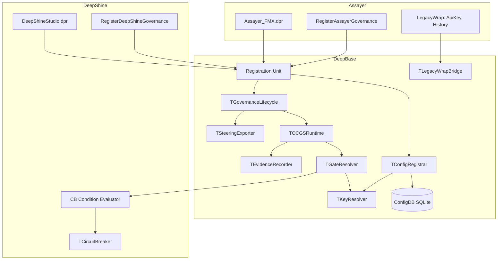

# Design Document: Governance Integration

## Overview

This design integrates the existing OCGS Governance module from `DeepBase/Governance/` into Assayer (FMX) and DeepShine (VCL) projects. The key architectural challenge is replacing the JSON-file-based `TConfigLoader` with a ConfigDB-backed registration path, while reusing the existing `TOCGSRuntime`, `TGateResolver`, `TKeyResolver`, `TEvidenceRecorder`, and `TSteeringExporter` components unchanged.

The integration follows a "code-registration" pattern: downstream projects call `RegisterGovernance` which programmatically creates gate/action objects and persists them to ConfigDB's `governance_*` tables. This avoids any JSON/INI/YAML config files in downstream projects.

### Design Decisions

1. **Extend `DeepBase.Governance.Registration` rather than replace it** — The existing unit takes a config directory path. We add an overload that takes no path and loads from ConfigDB instead.
2. **New `TConfigRegistrar` class** — A code-first alternative to `TConfigLoader` that accepts programmatic gate/action definitions and writes them to ConfigDB.
3. **CircuitBreaker-Governance linkage via custom `TConditionEvaluator`** — The `TGateResolver` already supports pluggable condition evaluators. DeepShine registers a `gckState` evaluator that checks CircuitBreaker state.
4. **Observe mode implemented at GateResolver level** — When mode is `observe`, the resolver always returns `gsOpen` but still records evidence via `TEvidenceRecorder`.

## Architecture



## Components and Interfaces

### 1. TConfigRegistrar (NEW — `DeepBase.Governance.ConfigRegistrar.pas`)

Code-first configuration registrar that writes governance definitions to ConfigDB.

```pascal
type
  TConfigRegistrar = class
  private
    FKeyResolver: TKeyResolver;
    FDBPool: IDBPool;  // existing DeepBase DB pool
    procedure EnsureTables;
    procedure UpsertGate(const AGateKey, ADisplayName: string;
      AGateType: TGateType; ARiskLevel: TRiskLevel;
      const AConditions: TArray<TGateCondition>);
    procedure UpsertAction(const AActionKey, ADisplayName: string;
      ARiskLevel: TRiskLevel; const AGateKey, APurposeKey: string);
    procedure UpsertPurpose(const AKey, AName, ADescription, AParentKey: string);
  public
    constructor Create(AKeyResolver: TKeyResolver; ADBPool: IDBPool);

    /// Register a gate definition (persists to ConfigDB + registers in KeyResolver)
    procedure RegisterGate(const AGateKey, ADisplayName: string;
      AGateType: TGateType; ARiskLevel: TRiskLevel;
      const AConditions: array of TGateCondition);

    /// Register an action definition
    procedure RegisterAction(const AActionKey, ADisplayName: string;
      ARiskLevel: TRiskLevel; const AGateKey: string;
      const APurposeKey: string = '');

    /// Register a purpose
    procedure RegisterPurpose(const AKey, AName, ADescription: string;
      const AParentKey: string = '');

    /// Load all definitions from ConfigDB into KeyResolver (for restart)
    procedure LoadFromDB;

    /// Get/set governance mode (observe/enforce)
    function GetMode: string;
    procedure SetMode(const AMode: string);
  end;
```

### 2. RegisterGovernance Overload (Modified — `DeepBase.Governance.Registration.pas`)

```pascal
/// Overload: register governance from ConfigDB (no config directory)
procedure RegisterGovernance(AEnabled: Boolean = True); overload;

/// Original: register from config directory (kept for backward compat)
procedure RegisterGovernance(const AConfigDir: string;
  AEnabled: Boolean = True); overload;

/// Shutdown governance
procedure ShutdownGovernance;

/// Access the global registrar for downstream gate/action registration
function GovernanceRegistrar: TConfigRegistrar;
```

### 3. Assayer Registration (`Assayer.Governance.Registration.pas` — NEW in Assayer/src/)

```pascal
unit Assayer.Governance.Registration;

interface

procedure RegisterAssayerGovernance;

implementation

uses
  DeepBase.Governance.Registration,
  DeepBase.Governance.ConfigRegistrar,
  DeepBase.Governance.Types,
  DeepBase.Governance.Model;

procedure RegisterAssayerGovernance;
var
  LReg: TConfigRegistrar;
begin
  // Initialize governance from ConfigDB
  RegisterGovernance(True);
  LReg := GovernanceRegistrar;

  // Register gates
  LReg.RegisterGate('deepllm.switch_model', 'Switch Model',
    gtAction, rlL2, []);
  LReg.RegisterGate('deepllm.update_apikey', 'Update API Key',
    gtAction, rlL3, []);
  LReg.RegisterGate('deepllm.delete_history', 'Delete History',
    gtAction, rlL3, []);
  LReg.RegisterGate('deepllm.generate_image', 'Generate Image',
    gtAction, rlL2, []);

  // Register actions
  LReg.RegisterAction('deepllm.action.switch_model', 'Switch Model',
    rlL2, 'deepllm.switch_model');
  LReg.RegisterAction('deepllm.action.update_apikey', 'Update API Key',
    rlL3, 'deepllm.update_apikey');
  LReg.RegisterAction('deepllm.action.delete_history', 'Delete History',
    rlL3, 'deepllm.delete_history');
  LReg.RegisterAction('deepllm.action.generate_image', 'Generate Image',
    rlL2, 'deepllm.generate_image');

  // Set initial mode to observe
  LReg.SetMode('observe');
end;
```

### 4. DeepShine Registration with CB Linkage (`DeepShine.Governance.Registration.pas` — NEW)

```pascal
unit DeepShine.Governance.Registration;

interface

procedure RegisterDeepShineGovernance;

implementation

uses
  System.JSON,
  DeepBase.Governance.Registration,
  DeepBase.Governance.ConfigRegistrar,
  DeepBase.Governance.Types,
  DeepBase.Governance.Model,
  DeepBase.Governance.GateResolver,
  DeepBase.Resilience.CircuitBreaker;

procedure RegisterDeepShineGovernance;
var
  LReg: TConfigRegistrar;
  LCBCondition: TGateCondition;
begin
  RegisterGovernance(True);
  LReg := GovernanceRegistrar;

  // CB-linked condition for LLM call gate
  LCBCondition := TGateCondition.Create(gckState,
    'circuit_breaker_closed',  // expression key
    'CircuitBreaker must be closed',
    'LLM calls blocked: circuit breaker is open');

  LReg.RegisterGate('deepshine.llm_call', 'LLM API Call',
    gtAction, rlL2, [LCBCondition]);
  LReg.RegisterGate('deepshine.publish_content', 'Publish Content',
    gtAction, rlL3, []);
  LReg.RegisterGate('deepshine.delete_task', 'Delete Task',
    gtAction, rlL2, []);

  // Register CB condition evaluator
  GovernanceLifecycle.Runtime.GateResolver.RegisterEvaluator(gckState,
    function(ACondition: TGateCondition; AContext: TJSONObject): Boolean
    var
      LBreaker: TCircuitBreaker;
    begin
      if ACondition.Expression = 'circuit_breaker_closed' then
      begin
        if CircuitBreakers.TryGet('DeepDeepShine-PG', LBreaker) then
          Result := LBreaker.State = csClosed
        else
          Result := True; // No breaker = allow
      end
      else
        Result := True; // Unknown expression = allow
    end);

  LReg.SetMode('observe');
end;
```

### 5. LegacyWrap Integration (Assayer)

The existing `TLegacyWrapBridge` is used to wrap API key modification and history deletion. These wraps are registered as bridges on the corresponding actions:

```pascal
// In Assayer form/service code where operations are triggered:
procedure TMainForm.DoUpdateApiKey;
var
  LBridge: TLegacyWrapBridge;
  LContext: TJSONObject;
  LResult: TActionResult;
begin
  LContext := TJSONObject.Create;
  try
    LContext.AddPair('user_id', CurrentUserId);
    LContext.AddPair('gate_key', 'deepllm.update_apikey');

    LResult := GovernanceLifecycle.Runtime.EnterGate(
      'deepllm.update_apikey', LContext, rmCommit);

    if LResult.Status = arsBlocked then
    begin
      ShowMessage('Operation blocked: ' + LResult.Message);
      Exit;
    end;

    // Actual operation (wrapped via LegacyWrapBridge internally)
    PerformApiKeyUpdate;
  finally
    LContext.Free;
  end;
end;
```

## Data Models

### ConfigDB Tables (governance_* schema)

```sql
CREATE TABLE IF NOT EXISTS governance_gates (
  key         TEXT PRIMARY KEY,
  display_name TEXT NOT NULL,
  gate_type   INTEGER NOT NULL DEFAULT 1,  -- TGateType ordinal
  risk_level  INTEGER NOT NULL DEFAULT 0,  -- TRiskLevel ordinal
  parent_key  TEXT DEFAULT '',
  field_key   TEXT DEFAULT '',
  created_at  TEXT DEFAULT (datetime('now')),
  updated_at  TEXT DEFAULT (datetime('now'))
);

CREATE TABLE IF NOT EXISTS governance_gate_conditions (
  id          INTEGER PRIMARY KEY AUTOINCREMENT,
  gate_key    TEXT NOT NULL REFERENCES governance_gates(key),
  kind        INTEGER NOT NULL,  -- TGateConditionKind ordinal
  expression  TEXT NOT NULL,
  description TEXT DEFAULT '',
  blocked_message TEXT DEFAULT ''
);

CREATE TABLE IF NOT EXISTS governance_actions (
  key          TEXT PRIMARY KEY,
  display_name TEXT NOT NULL,
  risk_level   INTEGER NOT NULL DEFAULT 0,
  gate_key     TEXT DEFAULT '',
  purpose_key  TEXT DEFAULT '',
  due_ref      TEXT DEFAULT '',
  created_at   TEXT DEFAULT (datetime('now')),
  updated_at   TEXT DEFAULT (datetime('now'))
);

CREATE TABLE IF NOT EXISTS governance_purposes (
  key          TEXT PRIMARY KEY,
  name         TEXT NOT NULL,
  description  TEXT DEFAULT '',
  parent_key   TEXT DEFAULT '',
  status       TEXT DEFAULT 'active'
);

CREATE TABLE IF NOT EXISTS governance_config (
  key   TEXT PRIMARY KEY,
  value TEXT NOT NULL
);
-- Initial row: ('mode', 'observe')
```

### Observe vs Enforce Mode Logic

The governance mode is stored in `governance_config` table with key `'mode'`. The `TGovernanceLifecycle` reads this on startup and the `TConfigRegistrar` can update it.

In **observe mode**, the `EnterGate` flow is modified:
- `TGateResolver.Resolve` still evaluates conditions normally
- If the gate would be blocked, `TEvidenceRecorder.LogBlocked` is called
- But the returned `TGateResolution.State` is overridden to `gsOpen`
- The action proceeds, and `TEvidenceRecorder.LogAction` records the result

In **enforce mode**, the standard flow applies — blocked gates return `arsBlocked`.

This is implemented by wrapping the `TGateResolver` in an `TObserveGateResolver` decorator:

```pascal
type
  TObserveGateResolver = class(TInterfacedObject, IGateResolver)
  private
    FInner: IGateResolver;
    FEvidenceRecorder: IEvidenceRecorder;
  public
    function Resolve(const AGateKey: string;
      AContext: TJSONObject): TGateResolution;
    function GetState(const AGateKey: string;
      AContext: TJSONObject): TGateState;
  end;

function TObserveGateResolver.Resolve(...): TGateResolution;
begin
  Result := FInner.Resolve(AGateKey, AContext);
  if Result.State <> gsOpen then
  begin
    // Record what would have been blocked
    FEvidenceRecorder.LogBlocked(AGateKey, Result.BlockedReason, AContext);
    // Override to open
    Result.State := gsOpen;
    Result.BlockedReason := '';
  end;
end;
```

### SteeringExporter Output Path

The `TSteeringExporter` writes to `{ProjectRoot}/.kiro/steering/governance-model.md`. The project root is determined by walking up from `ExtractFilePath(ParamStr(0))` until a `.kiro` directory or project file is found, or defaults to the exe directory.


## Correctness Properties

*A property is a characteristic or behavior that should hold true across all valid executions of a system — essentially, a formal statement about what the system should do. Properties serve as the bridge between human-readable specifications and machine-verifiable correctness guarantees.*

### Property 1: Registration Round-Trip

*For any* gate definition (with arbitrary key, display name, gate type, risk level, and conditions) and any action definition (with arbitrary key, display name, risk level, gate key), registering it via `TConfigRegistrar` and then calling `LoadFromDB` into a fresh `TKeyResolver` should produce objects with equivalent field values.

**Validates: Requirements 1.1, 1.3, 1.4**

### Property 2: Registration Idempotence

*For any* gate or action definition, calling `RegisterGate`/`RegisterAction` twice with the same key (but potentially different display names or risk levels) should result in exactly one record in the corresponding ConfigDB table, with field values matching the second registration call.

**Validates: Requirements 1.7**

### Property 3: Observe Mode Never Blocks

*For any* registered gate key and any JSON context, when governance mode is `observe`, calling `EnterGate` should never return a result with status `arsBlocked`.

**Validates: Requirements 2.6**

### Property 4: Observe Mode Records Evidence

*For any* registered gate key and any JSON context, when governance mode is `observe` and the gate would have been blocked (has failing conditions), calling `EnterGate` should result in at least one evidence entry being recorded with the gate key.

**Validates: Requirements 4.1**

### Property 5: Enforce Mode Blocks on Failing Conditions

*For any* registered gate with at least one condition that evaluates to false, and any JSON context, when governance mode is `enforce`, calling `EnterGate` should return a result with status `arsBlocked` and a non-empty message.

**Validates: Requirements 2.7, 4.2**

### Property 6: Export Contains All Registered Entities

*For any* set of registered gates, actions, and purposes, the string output of `TSteeringExporter.GetContent` should contain every registered gate key, every registered action key, and every registered purpose key as substrings.

**Validates: Requirements 2.8, 5.2, 5.3**

### Property 7: CircuitBreaker State Determines Gate Resolution

*For any* JSON context, the resolution state of `deepshine.llm_call` gate equals `gsBlocked` if and only if the CircuitBreaker named `'DeepDeepShine-PG'` has state `csOpen`.

**Validates: Requirements 3.4, 3.5**

### Property 8: Evidence Sanitization

*For any* JSON context containing both whitelisted fields and non-whitelisted fields (e.g., `api_key`, `password`), the `InputSummary` field of the recorded evidence entry should contain only whitelisted field names and should not contain any non-whitelisted field values.

**Validates: Requirements 4.4**

## Error Handling

| Scenario | Handling |
|----------|----------|
| ConfigDB unavailable at registration | Raise `EGovernanceInitError` — fail fast, governance is required |
| Gate key not found in `EnterGate` | Return `TActionResult.Fail` with "Gate not found" message (existing behavior) |
| Evidence write failure | Queue to failure queue, invoke failure callback, do not block caller (existing async behavior) |
| CircuitBreaker not registered in registry | Treat as closed (allow) — defensive default |
| `RegisterGate` with nil condition array | Register gate with no conditions (always open) |
| SteeringExporter output directory not writable | Log warning, skip export, do not crash application |
| Duplicate key registration | Upsert (update existing) — no error raised |

## Testing Strategy

### Framework

- **DUnitX** with `[TestFixture]` and `[Test]` attributes
- **Property-based testing**: DUnitX parameterized tests with randomized inputs using a simple generator helper class
- **Library**: No external PBT library — use DUnitX `[RepeatTest(100)]` attribute with randomized setup in each iteration

### Test Files

| File | Purpose |
|------|---------|
| `Assayer/tests/Test.Assayer.Governance.pas` | Assayer governance integration tests |
| `DeepShine/Tests/Test.DeepShine.Governance.pas` | DeepShine governance + CB tests |
| `DeepBase/Tests/Test.DeepBase.Governance.ConfigRegistrar.pas` | ConfigRegistrar unit + property tests |

### Dual Testing Approach

**Unit tests** (specific examples):
- Verify four Assayer gates registered with correct risk levels
- Verify three DeepShine gates registered correctly
- Verify steering file contains expected markdown structure
- Verify LegacyWrap bridge executes wrapped procedure

**Property tests** (universal properties, 100 iterations each):
- Property 1: Registration round-trip with random gate/action definitions
- Property 2: Registration idempotence with random keys and varying values
- Property 3: Observe mode never blocks with random gates and contexts
- Property 5: Enforce mode blocks with random failing conditions
- Property 6: Export contains all entities with random registration sets
- Property 7: CB state determines gate resolution with random contexts
- Property 8: Evidence sanitization with random context fields

Each property test is tagged with:
```
// Feature: governance-integration, Property N: <property_text>
```

### Test Configuration

- Each property test runs minimum 100 iterations via `[RepeatTest(100)]`
- Tests use in-memory SQLite for ConfigDB isolation
- Tests create fresh `TKeyResolver` + `TGateResolver` instances per fixture
- CircuitBreaker tests use a dedicated `TCircuitBreaker` instance with controlled state
