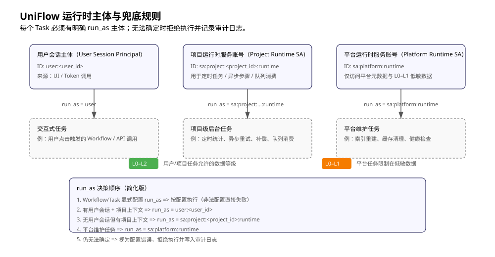

# DeepFlow 安全与数据权限策略
> **版本**: 1.0  
> **更新日期**: 2025-12-03  
> **关联文档**: `03.01.Arch-DeepFlow架构设计-v1.0.md` / `04.01.Data-DeepFlow数据模型-v1.0.md` / `03.05.Arch-DeepFlow-版本与实验策略-v1.0.md` / `05.02.API-DeepFlow-MCP支持规划-v1.0.md`
---
## 1. 文档目的
本文件定义DeepFlow 在**数据、安全与权限**方面的总体策略，用于约束：
- 不同数据的敏感级别与访问规则
- 11 角色与人类用户之间的权限边界
- 对外调用（LLM / MCP / 云同步）的数据出站规则
- 日志与审计中允许/禁止出现的内容
目标是：
> 在保持DeepFlow 强大能力的同时，确保"最小权限、可追溯、可解释、可回滚"
---
## 2. 适用范围与优先级
本策略适用于：
- 所有DeepFlow 相关代码（Delphi / Python）和配置
- 所有DeepFlow 相关的数据表、日志与云同步数据
- 所有通过 DeepFlow 发起的外部调用（LLM / MCP / HTTP / DB / 云服务）
优先级说明：
- 当本策略与功能需求发生冲突时，**安全优先于功能，功能必须调整**
- 当本策略与性能发生冲突时，**先保证安全与正确性，再优化性能**
---
## 3. 数据分级模型
### 3.1 等级定义
DeepFlow 将数据按敏感度分为四级：
- **L0 公开级（Public）**
  - 无需身份验证即可公开的信息
  - 如：公开文档示例、基本产品说明、不含业务细节的统计数据
- **L1 内部级（Internal）**
  - 仅在本地应用内部使用，但不包含直接个人隐私或敏感业务机密
  - 如：Workflow 拓扑、Skill 元数据（名称、版本）、匿名化运行统计
- **L2 敏感级（Sensitive）**
  - 涉及个人隐私、业务决策内容或可推断出用户画像的数据
  - 如：决策问题与胶片、会话内容、项目文档摘要、用户画像字段
- **L3 机密级（Confidential）**
  - 安全基础设施与关键凭证
  - 如：API Key、MCP/LLM 访问 Token、加密密钥材料、多租户的内部配置细节
原则如下：
- **默认至少按 L1 对待**
- 如有疑问，按更高敏感度处理（宁高勿低）
### 3.2 典型数据映射
- L0
  - 公共文档样例、产品营销材料
- L1
  - `workflow_definitions`（不含具体用户输入）
  - `skills` 元数据（不含实现细节中的密钥）
  - 聚合统计：调用次数、错误率、平均耗时
- L2
  - `sessions` / `messages` / `memories` / 决策胶片（如 X 光片）
  - `user_profiles`（用户画像）、`project_memories`（项目记忆）
- L3
  - `llm_configs.api_key_encrypted`
  - 外部 MCP / SaaS 的凭据
  - `tenants.quota_json` 中可能包含的敏感限制
表设计与实现时，应在注释或文档中标明字段敏感级别。
---
## 4. 访问控制模型（人 + 机）
### 4.1 主体与角色
访问主体分为三类：
- 人类用户
  - 终端用户（使用洞见 / 元老院等产品）
  - 管理员 / 运维 / 审计员
- 系统内部角色
  - UpFlow 11 角色（Engine/Commander/Executor/Guard/Quartermaster 等）
  - DeepBase 服务组件（EventBus / DB / Logging / Scheduler 等）
- 外部系统
  - Python Skill 服务
  - MCP 服务 / 第三方 API
### 4.2 RBAC + ABAC 混合模型
- RBAC（基于角色）
  - 使用 `roles` / `user_roles` 表定义“能做什么事”（操作级权限）
  - 如：`pWorkflowRun`、`pAuditView`、`pTenantManage` 等
- ABAC（基于属性）
  - 由 Guard / 数据访问层基于上下文做细粒度判断。
    - `tenant_id` / `user_id` / `product_id` / `session_id` / `owner_id`
  - 例：同一操作 `ReadDecision`，不同用户只能读取：
    - 自己的决策；或
    - 本租户、被授权范围内的决策
### 4.3 Security Context
建议在上游 Core 引入统一安全上下文：
```pascal
type
  TDataLevel = (dlPublic, dlInternal, dlSensitive, dlConfidential);

  TSecurityContext = record
    TenantId: string;
    UserId: string;
    Roles: TArray<string>;
    MaxDataLevel: TDataLevel; // 当前调用预期可触达的最高数据敏感级别
    Source: string;           // UI / Script / MCP / Test 等
  end;
```
所有对外部接口、DB、日志、Skill 调用的入口，都必须携带或构建 `TSecurityContext`。
- Guard 根据 Context 决定是否允许访问 L2/L3 数据
- Logging 决定是否需要脱敏
- MCP/LLM 调用决定是否允许出站敏感内容

### 4.4 运行时主体与兜底规则

在运行时，每一个 Task 必须有明确的执行主体（Principal），系统不允许出现"无主任务"。当无法确定主体时，任务应拒绝执行并记录审计日志，而不是自动提升权限或使用高权限账号兜底。

运行时主体分为三类：

1. **用户会话主体（User Session Principal）?**
   - 标识：`user:<user_id>`
    - 场景：前端点击触发、用调?Access Token 直接调用 DeepFlow API。
    - 权限：等同于该用户在当前作用域/项目下的 RBAC/ABAC 权限（受数据等级约束）。

2. **项目运行时服务账号（Project Runtime Service Account）?**
   - 标识：`sa:project:<project_id>:runtime`
    - 场景：项目内 Workflow 的异步步骤、重试、补偿，定时任务，队列消费等处理。
    - 权限：
      - 仅限本项目空间下授权资源；
      - 默认最高可访问L2 数据，不得直接访L3 机密数据。
      - 是否允许出站到外域LLM/MCP 由军需官在项目配置中显式授权。

3. **平台运行时服务账号（Platform Runtime Service Account）?**
   - 标识：`sa:platform:runtime`
    - 场景：平台级维护任务，如索引重建、缓存清理、健康检查、跨项目聚合统计等操作。
    - 权限管理。
- 仅允许访问平台级元数据及 L0–L1 低敏数据范围
- 默认禁止访问任何具体项目/空间内的 L2/L3 业务数据范围

运行时主体与 Task 归属规则？

- 每个 Task 逻辑上都应具备：
  - `owner_project_id`：所属项目（可为空表示平台级任务）；
  - `initiator_principal`：最初发起主体（用户或服务账号）？
- `run_as`：本次执行采用的运行主体。
决策顺序：
1. `Workflow/Task` 定义中显式配置了 `run_as`（如 `user` / `project_runtime` / 指定服务账号），按配置执行，非法配置应在调度阶段直接失败。
2. 若无显式配置，且存在用户会话与项目上下文，则 `run_as = initiator_principal`。
3. 若无用户会话但存在项目上下文，则 `run_as = sa:project:<owner_project_id>:runtime`。
4. 若为平台维护任务（无项目上下文且被标注为平台任务），`run_as = sa:platform:runtime`。
5. 若以上规则均无法确定，则视为配置错误，任务不得执行，并写入审计日志由人工处理。

在该规则下：

- 军需官负责为项目运行时服务账号配置配额、数据等级上限和外部调用策略。
    - 安全负责人负责审核平台级服务账号的权限范围，以及涉及提升服务账号权限（特别是访问 L3 或跨项目）的变更管控。
    - 平台不得为了"修复任务失败"而在无人干预的情况下自动提升任一服务账号权限操作。



---
## 5. 11 角色信任与权限边界。
基于 `03.01.Arch-DeepFlow架构设计-v1.0.md`，对 11 角色的信任与数据权限做补充约束：
    - 完全信任区（L0/L1 读写，L2 受限，L3 极少）。
  - Engine（引擎）
- 管理系统生命周期、角色扮演
- 可访问大部分配置，但不直接处理 L2 内容
  - Inspector（督察）
    - 可查看系统状态与部分运行轨迹
- 默认只查看匿名化/汇总信息，二级内容需要额外授权
  - Logistics（后勤）
- 负责读写记忆，但应通过统一 Memory 接口访问，避免随意SQL 查询
- Chronicler（记录员角色）
      - 写入审计与系统日志，但必须遵守"日志脱敏规则"。
- 有限信任区（L1/L2 受控，L3 禁止访问?
  - Commander / Dispatcher
    - 决定任务分解与流程编排，需要访问部门 L2 数据
    - 不可直接读写 L3 密钥/凭证
  - Guard
可读取必要字段进行校验，但输出日志必须脱敏
  - Quartermaster（军需官）
    - 管理 Skill registry、配额与资源使用
可访问Skill/LLM/MCP 的"引用信息"，但具体密钥由 SecretManager 管理
  - SignalOfficer（通信官）
    - 负责外部通信，不应持久化任何 L2/L3 数据
- 不信任区（输出必须被 Guard 校验的）
  - Advisor（智囊）
- LLM 调用封装，默认不信任其输出，必须经 Guard 校验后才能进入记忆界面
  - Executor（执行者）
      - 执行 Skill（包括外部 MCP），其结果必须经 Guard 校验。
结论。
> Advisor / Executor 产出的任何结果，在进入会话/记忆/外部系统前，都必须经 Guard 进行格式、安全与策略校验。
---
## 6. 密钥与凭证管理。
### 6.1 Secret 管理抽象
- 在DeepBase 中引入统一抽象：`DeepBase.Security.Secrets`
  - 提供对Key 读取/刷新密钥的接口
  - 实现可以先基于本地加密存储，后续可替换为系统密钥环或云KMS
- Delphi / Python 代码**只通过 Secrets 抽象获取敏感数据**，禁止：
  - 的Key/Token 硬编码在源码中
  - 将明文Key/Token 写入日志、错误信息或 UI
### 6.2 环境变量与配置
  - 允许通过环境变量给Python Skill / MCP 客户端注入Key/Token，但仅
  - 环境变量名应清晰标识（如 `UNIFLOW_LLM_API_KEY`）
  - 不在应用中打印环境变量名
  - 配置文件中仅保存引用
  - Key ID / Profile 名称等非敏感引用

### 6.3 Key 轮换
- 设计期预留 Key 轮换机制。
  - 支持同时存在新旧两套密钥
- 调用路径能够区分使用哪一个。
- 日志中可追踪"当时使用的是哪一个"Key Profile，而非明文
---
## 7. 日志与审计策略
### 7.1 日志内容约束
系统日志（`system_logs`）与应用日志中：
- 禁止出现。
  - 明文密码 / API Key / Token / 私密证书
- 完整个人身份信息（身份证号、银行卡号等。
- 谨慎出现。
- 决策问题全文、用户输入全部。
  - 如需记录，建议：
    - 仅记录摘要或哈希
    - 或通过配置控制是否记录明细
- 可以出现。
  - 错误码、模块名、简短的错误信息
  - 统计类信息（条数、时长、状态）
### 7.2 审计日志要求
在审计表（`audit_logs` / `audit_logs_detailed`）中。
- 必须记录。
- 操作主体（UserId / ActorType)。
- 操作对象（ResourceType / ResourceId)。
- 动作类型（Action，如 SkillExecute / WorkflowStart / ConfigChange)。
- 结果（Result：Success/Failure)。
  - 时间戳与租户 ID
  - 关键版本信息（见 `03.02` 文档）：
    - `platform_version`
    - `workflow_def_id` + `workflow_def_version`
    - `skill_name` + `skill_version`
- 建议记录。
  - 高层次输出：输出摘要（不含敏感字段）
  - 来源（UI / MCP / CLI / BatchJob？）
### 7.3 日志保留与清单
- 参照`retention_policies` 设计时
  - 系统日志：默认保留30~90 天，可由租户策略调整
  - 审计日志：根据合规要求保留更久（如1~3 年）
- 定期运行清理任务？
  - 按策略删除或归档旧日志
  - 确保不会无限制增长？
---
## 8. 外部调用与数据出站策略？
### 8.1 LLM 调用
- 对LLM 的调用（Advisor 角色）应遵守规则
  - 默认不发送L3 数据
  - 尽量避免发送原始L2 内容，可通过摘要
    - 先做摘要
    - 或仅发送结构化指标/标签
- 对于必须发送的敏感内容？
  - 需在产品设置中有明确的用户同意选项
  - 在租户策略中可禁用此类调用？
### 8.2 MCP / 外部 Skill 调用
- 通过 MCP / HTTP 调用外部服务时：
  - 默认仅发送L0/L1 数据
- L2 数据需经过 Guard 审核与脱敏
- L3 数据一律禁止出境
- 对接第三方 SaaS 时：
- 建议先走只读场景（如搜索 / 获取列表）
- 对写入/删除类操作需在 Workflow 中显式增加审批节点（HumanTask）
### 8.3 云同步（1.0+）
- 云端仅存储：
- 用户账号、Skill 市场元数据
- 用户明确选择同步的决策/配置
- 默认不同步：
  - 审计日志
  - 系统内部运行日志
- 未经用户明确授权的决策内容
---
## 9. MCP 第三方服务准入标准（2025-12-04 补充）

> 团队评审 P1 改进项，定义 MCP 第三方服务的安全准入流程与标准。

### 9.1 准入流程概览

```
│               MCP 第三方服务准入流程                         │
├─────────────────────────────────────────────────────────────────┤
│                                                                │
│  1️⃣ 申请      2️⃣ 安全评审     3️⃣ 技术验收    4️⃣ 注册上线     │
│  ┌───────┐   ┌───────┐   ┌───────┐   ┌───────┐       │
 步骤 ┌───────│   ┌───────│   ┌───────│   ┌───────│       │
 步骤  开始填写   │───▶│ 安全   │───▶│ 沙箱   │───▶│ 审批   │       │
 步骤  风险评估 │  仿真安全  │  安全测试  │  正式上线  │       │
 步骤 └───────│   └───────│   └───────│   └───────│       │
 步骤      │             │             │             │           │
 步骤      │             │             │             │           │
 步骤 [拒绝]         [拒绝]         [拒绝]         [注册]          │
 步骤 信息不全       风险过高       测试失败       完成准入          │
 步骤                                                                │
└─────────────────────────────────────────────────────────────────│
```

### 9.2 服务分类与风险等级

| 风险等级 | 服务类型 | 示例 | 准入要求 |
|----------|----------|------|----------|
| **低风险** | 只读查询 | 天气、汇率、公开数据 API | 基础评估 + 沙箱测试 |
| **中风险** | 读写业务数据 | 日历、邮件、CRM 集成 | 安全评审 + 权限审核 |
| **高风险** | 涉及敏感数据/财务 | 支付、人事、数据库操作 | 完整安全评审 + 人工审批 |
| **禁止** | 超出安全边界 | 执行任意代码、管理员操作 | 禁止接入 |

### 9.3 准入评估检查清单

#### 9.3.1 基础信息（必填）

| 检查项 | 说明 | 通过标准 |
|----------|------|----------|
| 服务名称 | 唯一标识 | 符合命名规范 |
| 服务描述 | 功能说明 | 清晰、完善 |
| 提供者 | 服务提供者 | 已知、可评估 |
| 服务地址 | Endpoint URL | 可访问、HTTPS |
| 文档链接 | API 文档 | 完整、可用 |
| 联系方式 | 技术支持 | 有效 |

#### 9.3.2 安全评估（必查）

| 检查项 | 说明 | 通过标准 |
|----------|------|----------|
| 认证方式 | OAuth/API Key/SSO | 支持安全认证 |
| 数据加密 | 传输加密 | TLS 1.2+ |
| 数据出站 | 发送什么数据 | 符合数据分级策略 |
| 数据入站 | 接收什么数据 | 需要Guard 校验 |
| 权限范围 | 可执行操作 | 最小权限原则 |
| 审计日志 | 是否记录调用 | 必须记录 |
| 服务可用性 | SLA 承诺 | 明确档期 |
| 故障处理 | 异常响应 | 有降级方案 |

#### 9.3.3 技术验证（必测项）

| 测试项 | 说明 | 通过标准 |
|----------|------|----------|
| 连通性测试 | 基本调用 | 成功响应 |
| 异常输入测试 | 边界值/恶意输入 | 正确拒绝/处理 |
| 超时测试 | 模拟慢响应 | 不堵塞、有超时 |
| 并发测试 | 多请求 | 稳定、不崩溃 |
| 数据校验测试 | 返回格式 | 符合 Schema |
| 安全测试 | 注入/越权 | 无漏洞 |

### 9.4 权限策略配置

```json
{
  "mcp_service": {
    "name": "example_calendar_service",
    "version": "1.0",
    "risk_level": "medium",
    "permissions": {
      "data_access": {
        "max_level": "L1",
        "allowed_fields": ["title", "time", "location"],
        "denied_fields": ["attendees_email", "private_notes"]
      },
      "operations": {
        "allowed": ["read", "create", "update"],
        "denied": ["delete", "bulk_export"]
      },
      "rate_limit": {
        "requests_per_minute": 60,
        "requests_per_day": 10000
      }
    },
    "guard_rules": {
      "input_validation": true,
      "output_sanitization": true,
      "pii_filter": true
    },
    "audit": {
      "log_all_calls": true,
      "log_payload": false,
      "alert_on_error": true
    },
    "fallback": {
      "on_error": "return_error",
      "on_timeout": "return_cached",
      "timeout_ms": 30000
    }
  }
}
```

### 9.5 运行时安全控制

#### 9.5.1 Guard 校验规则

所有 MCP 调用必须经过 Guard 三层校验规则

```pascal
// MCP 调用前校验
function TMCPGuard.ValidateRequest(ARequest: TMCPRequest): TGuardResult;
begin
  // 1. 检查服务是否已准入
  if not FServiceRegistry.IsApproved(ARequest.ServiceName) then
    Exit(TGuardResult.Reject('服务未准入'));
  
  // 2. 检查操作是否允许
  if not FPermissions.IsOperationAllowed(ARequest.ServiceName, ARequest.Operation) then
    Exit(TGuardResult.Reject('操作未授权'));
  
  // 3. 检查数据等级
  if GetDataLevel(ARequest.Payload) > FPermissions.GetMaxDataLevel(ARequest.ServiceName) then
    Exit(TGuardResult.Reject('数据等级超限'));
  
  // 4. 输入消毒
  ARequest.Payload := FSanitizer.Sanitize(ARequest.Payload);
  
  // 5. PII 过滤
  if FPermissions.RequiresPIIFilter(ARequest.ServiceName) then
    ARequest.Payload := FPIIFilter.Filter(ARequest.Payload);
  
  Result := TGuardResult.Allow;
end;

// MCP 响应校验
function TMCPGuard.ValidateResponse(AResponse: TMCPResponse): TGuardResult;
begin
  // 1. 校验响应格式
  if not FSchemaValidator.Validate(AResponse.ServiceName, AResponse.Data) then
    Exit(TGuardResult.Reject('响应格式异常'));
  
  // 2. 检查是否包含禁止字段
  if ContainsDeniedFields(AResponse.ServiceName, AResponse.Data) then
    Exit(TGuardResult.Reject('响应包含禁止字段'));
  
  // 3. 安全内容检查
  if FContentScanner.HasSecurityRisk(AResponse.Data) then
    Exit(TGuardResult.Reject('响应包含安全风险'));
  
  Result := TGuardResult.Allow;
end;
```

#### 9.5.2 调用链路追踪

每次 MCP 调用必须记录完整链路追踪

```json
{
  "trace_id": "trace-abc123",
  "mcp_call": {
    "service": "calendar_service",
    "operation": "create_event",
    "timestamp": "2024-12-04T10:30:00Z",
    "duration_ms": 234,
    "initiator": {
      "type": "user",
      "id": "user-001",
      "session_id": "sess-xyz"
    },
    "context": {
      "workflow_id": "wf-123",
      "step_id": "step-5"
    },
    "guard_result": {
      "input_check": "passed",
      "output_check": "passed"
    },
    "result": {
      "status": "success",
      "error": null
    }
  }
}
```

### 9.6 服务生命周期管理

| 阶段 | 操作 | 责任人 |
|------|------|--------|
| 申请 | 填写准入评估报告 | 开发者 |
| 评审 | 安全审核 + 技术验收 | 仿安(安全) + 鲁班(开发) |
| 审批 | 决定是否准入 | 盘古(架构) |
| 上线 | 注册到服务注册表 | 军需官 |
| 监控 | 持续监控调用指标 | 督察 |
| 复审 | 定期重新评估（每季度一次）| 仿安 |
| 下线 | 移除或禁用服务 | 军需官 |

### 9.7 禁止清单

以下类型：MCP 服务**禁止接入**：

| 禁止类型 | 说明 | 原因 |
|----------|------|------|
| 任意代码执行 | 可执行用户提供的代码 | 安全风险极高 |
| 管理员操作 | 系统/数据库管理功能 | 超出业务范围 |
| 无认证写入 | 不需认证即可写入数据 | 安全风险 |
| 无限制查询 | 无分组无限制的数据查询 | 资源风险 |
| 敏感数据导出 | 批量导出 PII/机密数据 | 数据泄露风险 |
| 不可审计服务 | 不提供日志无法追溯 | 合规风险 |

---
## 10. 数据保留与删除
### 9.1 保留策略
- 对不同数据类型定义默认保留期限
  - 会话与工作记忆：按会话结束后一定时间清理
  - 决策记录与胶片：长期保存，但用户可手动删除
  - 审计日志：遵循法规与企业策略（例如至少 1 年）
### 9.2 用户删除请求
- 对终端用户，至少支持执行
  - 删除单次决策/会话
  - 清空个人画像（User Profile）
- 删除时需执行
  - 删除主记录
  - 清理相关索引（向量表、全文索引）
  - 标记相关审计日志中不再可直接关联到真实身份（视法规而定）
### 9.3 合规支持（GDPR 等）
- 设计期预留：
  - 导出个人数据的接口（Data Export）
   - 按租户配置的数据保留与自动清理策略
---
## 10. 测试与治理
### 10.1 安全与权限测试
- 为关键安全策略设计固定回归用例：
   - 不同租户之间的数据隔离
   - 未授权访问敏感资源时的拒绝行规则
   - 日志与审计中不出现禁止信息
### 10.2 MCP/外部调用安全测试
- 通过模拟恶意输入验证有效
   - Guard 能拦截危险Payload
  - 外部调用不会泄露敏感数据
  - 日志中不记录完整恶意 Payload
### 10.3 策略变更管理
- 每次安全策略变更应：
   - 有变更记录（Why / What / Impact / Rollback方案）
   - 视为高风险变更，走专门评审流程
   - 记录在审计日志中，便于追踪
---
## 11. 相关文档
- `03.01.Arch-DeepFlow架构设计-v1.0.md`  
- `03.05.Arch-DeepFlow-版本与实验策略`v1.0.md`
- `04.01.Data-DeepFlow数据模型-v1.0.md`  
- `05.01.API-DeepFlow接口规范-v1.0.md`  
- `05.02.API-DeepFlow-MCP支持规划-v1.0.md`  
- `06.03.Dev-DeepFlow-MVP开发规范`v1.0.md`
- `06.05.Dev-DeepFlow-1.0开发规范`v1.0.md`
- `06.07.Dev-DeepFlow-理想版本规范-v1.0.md`
---
*文档版本: 1.0*  
*更新日期: 2025-12-03*